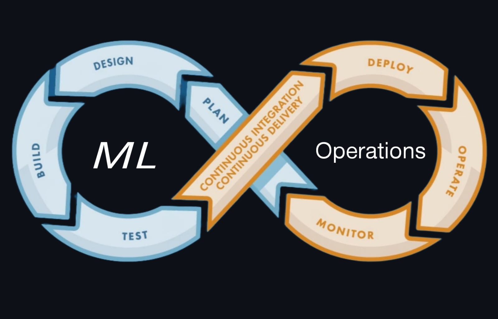

<p align="center">
  
</p>

# 🫀 CardioCastMLOps — Heart Disease Prediction with MLOps

**"From Model to Monitor" — A complete beginner-friendly MLOps pipeline using FastAPI, Streamlit, CI/CD, and XGBoost with 95% accuracy!**
---

## 🚀 Project Summary

CardioCastMLOps is an end-to-end machine learning system that predicts heart disease using a trained XGBoost model. It includes:

✅ API endpoint via FastAPI  
✅ Web UI via Streamlit  
✅ CI/CD integration with GitHub Actions  
✅ Automated deployment on Render  
✅ Clean, modular, and beginner-friendly MLOps structure  

> This project is built to help beginners step into MLOps while delivering a real, production-ready ML product.

---

## 🧠 Project Story

After building a highly accurate heart disease prediction model (95% accuracy), the next challenge was to operationalize the model — making it available as a reliable, scalable service.

I decided to go full-stack MLOps:

⛓️ Build an API  
🧪 Test it  
🚀 Deploy it  
📦 Automate it  
💡 Add a UI for users  

And thus, **CardioCastMLOps** was born.

---

## 📌 Key Features

| Feature         | Description                                               |
|-----------------|-----------------------------------------------------------|
| ⚙️ Model         | XGBoost (Gradient Boosted Trees) trained on heart dataset |
| 🚀 API Server    | Built with FastAPI (lightweight, fast)                    |
| 🎨 UI            | Streamlit frontend for user interaction                   |
| 🔁 CI/CD         | GitHub Actions for automated testing + deployment         |
| ☁️ Deployment    | Hosted on Render (free tier)                              |
| 📦 Linting       | Clean code ensured using Flake8                           |
| ✅ Unit Tests     | FastAPI test cases with `unittest` & `TestClient`         |

---

## 🖼️ Streamlit Web UI

A clean and minimal interface built using **Streamlit**.

**Features:**

- Easy-to-use form to enter health parameters  
- Displays prediction and confidence score  
- Fast and responsive frontend  

### ▶️ Run Streamlit UI Locally

```bash
streamlit run app/streamlit_ui.py
```

---

## 🌐 Live Demo

🔗 [https://cardiocast-mlops.onrender.com/](https://cardiocast-mlops.onrender.com/)

---

## 🛠️ Technologies Used

- **Machine Learning**: XGBoost  
- **API Framework**: FastAPI  
- **Frontend**: Streamlit  
- **Testing**: Unittest + FastAPI `TestClient`  
- **Linting**: Flake8  
- **CI/CD**: GitHub Actions  
- **Deployment**: Render  

---

## 🧪 Run Locally (API)

```bash
uvicorn app.main:app --reload
```

Visit Swagger docs at: [http://localhost:8000/docs](http://localhost:8000/docs)

---

## 🔁 Run Unit Tests

```bash
python -m unittest tests/test_api.py
```

---

## 🤖 CI/CD Workflow

On every `push` or `pull request` to GitHub:

- ✅ Flake8 linter checks run  
- ✅ All unit tests are executed  
- ✅ If successful, auto-deploys to Render  

---

## 📚 What I Learned

- How to structure ML code for production
- How to use FastAPI to build APIs
- How to write unit tests with `unittest`
- How to use CI/CD pipelines with GitHub Actions
- How to build a user-facing frontend using Streamlit
- How to deploy a live ML system using Render

---

## 📌 Future Enhancements

- 🔍 Add monitoring & logging (e.g. Prometheus, Loguru)  
- 📈 Build a performance dashboard  
- 🧠 Integrate auto-retraining pipeline  

---

## 👋 Final Note


This isn’t just a machine learning model — it’s a **pipeline**, a **product**, and a real-world **end-to-end solution**.  
I went beyond notebooks and accuracy scores to build a fully operational **MLOps system** — complete with API, testing, CI/CD, deployment, and a live user interface.  

With **CardioCastMLOps**, I’ve demonstrated not just model-building, but the ability to **engineer, deploy, and serve** machine learning at scale.  

This project represents my transition — from student to **applied ML engineer**.

---

## 🔗 Connect with Me

🌐 [My Portfolio](https://shahabzack.github.io/Ds_portfolio/)  
📧 Let's connect on [LinkedIn](https://www.linkedin.com/in/muhammed-shaheb-085859279/)
